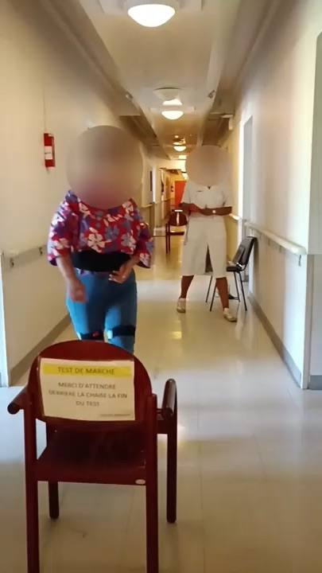
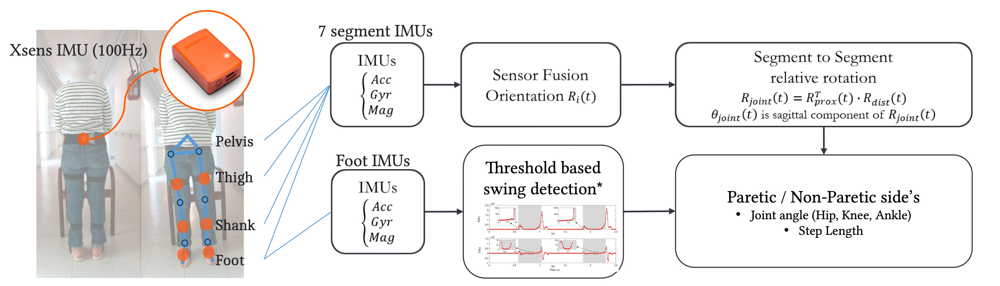
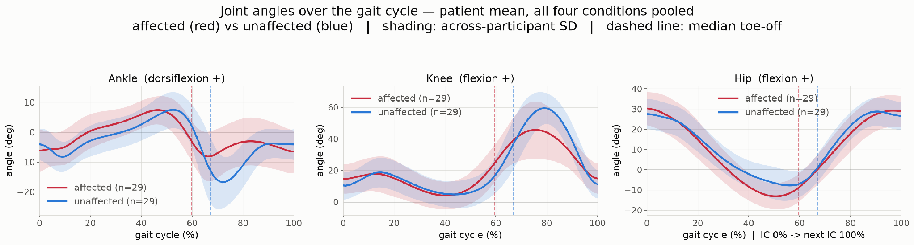

### [{alt="Participant completing a 10-metre walking assessment in a hospital corridor"}]{.research-thumbnail .research-thumbnail-media} [Wearable Movement Assessment]{.research-theme} [Gait assessment after stroke]{.research-card-title} [Manuscript under review.]{.research-preview}

#### Wearable gait assessment during self-rehabilitation {#movement-assessment}

::: {.research-meta}
LISSI · Clinical gait analysis · [Under review]{.fes-status} 2026
:::

How does walking change during guided self-rehabilitation after stroke? In a prospective cohort study, wearable sensors measured gait over eight weeks. The analysis compares participants following a guided self-rehabilitation contract (GSC) with those without one (non-GSC).

::: {.gait-study}

##### From wearable sensors to gait measures

Seven 100 Hz Xsens IMUs were placed on the pelvis, both thighs, both shanks, and both feet. Their signals were used to estimate lower-limb joint motion and walking measures during the 10-metre ambulation test (AT10).

```{=html}
<figure class="gait-figure">
<a href="images/assessment-method.png" target="_blank" rel="noopener" aria-label="Open the wearable gait assessment method diagram at full size">

</a>
<figcaption>Wearable sensing and gait-measurement workflow.</figcaption>
</figure>
```

##### Clinical protocol

The single-centre study at Henri-Mondor Hospital included **26 people with post-stroke hemiparesis** (15 GSC; 11 non-GSC) and **30 healthy controls**. Participants completed AT10 in four conditions: shoes or barefoot, each at comfortable or maximal speed.

```{=html}
<div class="assessment-protocol">
<div class="gait-table-wrap">
<table class="gait-table fes-line">
<caption>Assessment visits across eight weeks</caption>
<thead><tr><th scope="col">Visit</th><th scope="col">Purpose</th></tr></thead>
<tbody>
<tr><th scope="row">D1</th><td>Familiarisation</td></tr>
<tr><th scope="row">D14</th><td>Baseline</td></tr>
<tr><th scope="row">D28 and D42</th><td>Interim assessments, two weeks apart</td></tr>
<tr><th scope="row">D56</th><td>End-point assessment</td></tr>
</tbody>
</table>
</div>
<figure class="gait-figure assessment-video-figure">
<video class="gait-video" autoplay muted loop controls playsinline preload="metadata" poster="images/assessment-at10-poster.jpg" width="400" height="720" aria-label="AT10 ten-metre walking test in a hospital corridor">
<source src="videos/AT10.mp4" type="video/mp4">
<a href="videos/AT10.mp4">Download the AT10 video</a>.
</video>
<figcaption>AT10: a 10-metre walk in the clinical corridor.</figcaption>
</figure>
</div>
```

##### Joint angles through the gait cycle

```{=html}
<figure class="gait-figure">
<a href="images/assessment-joint-angles.png" target="_blank" rel="noopener" aria-label="Open the ankle, knee and hip joint-angle plots at full size">

</a>
<figcaption>Patient mean across four walking conditions; shaded bands show across-participant SD.</figcaption>
</figure>
```

:::

**Related work**

- Gait Changes During Guided Self-Rehabilitation (JNER, 2026; under review)

**Other assessment work**

I have also used a portable IMU alternometer to quantify forearm pronation–supination for assessment of parkinsonian motor impairment.
