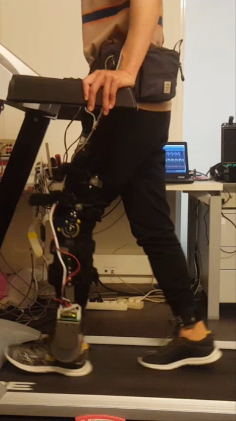
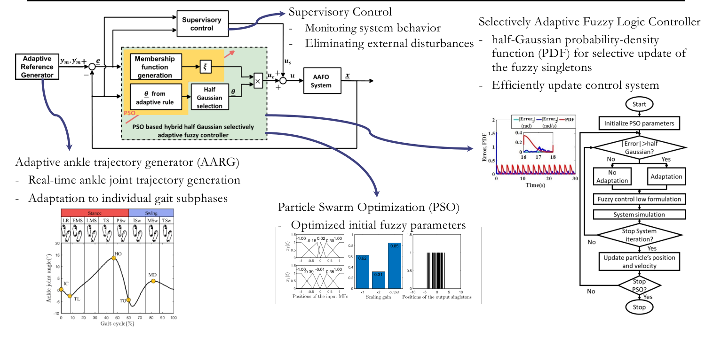
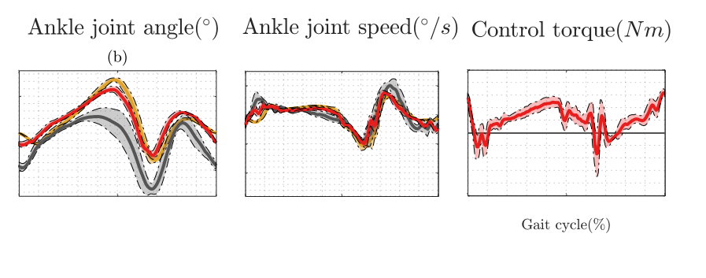
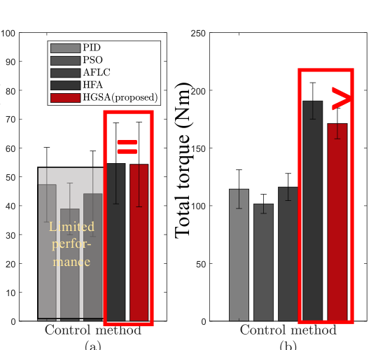
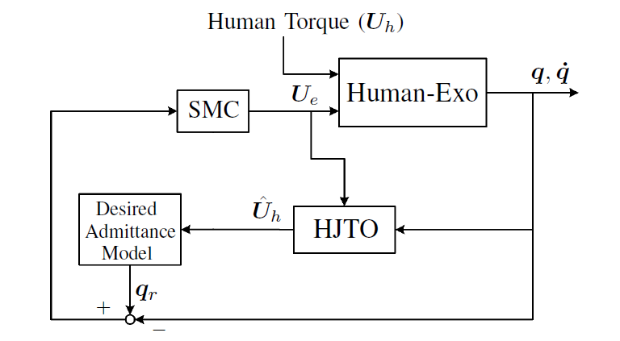
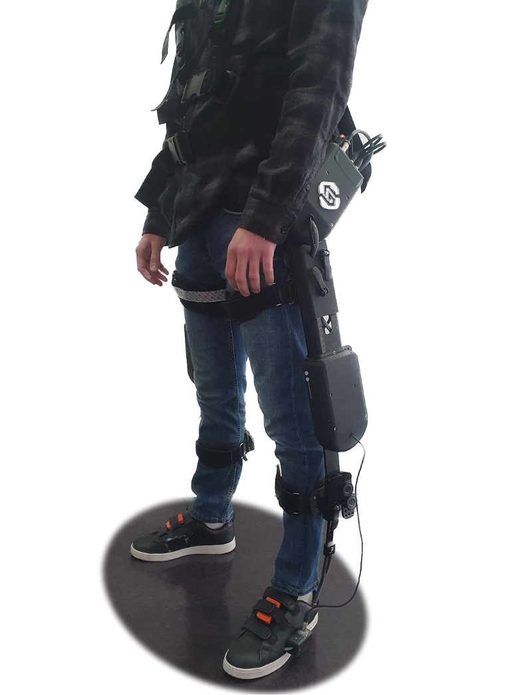
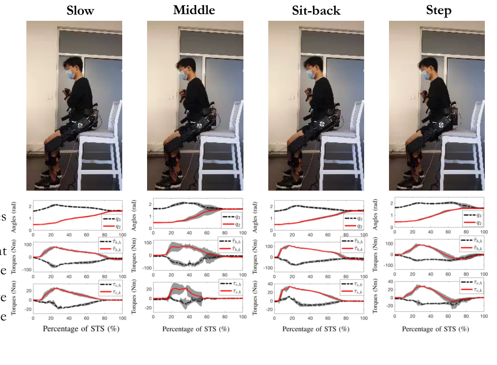
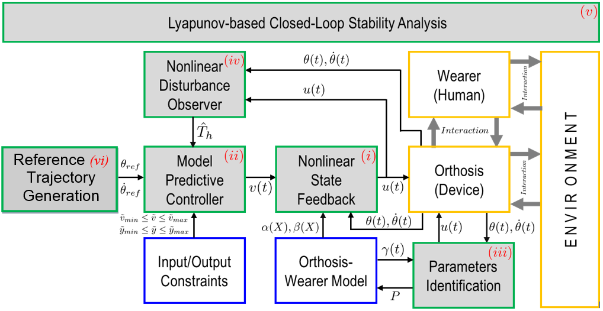
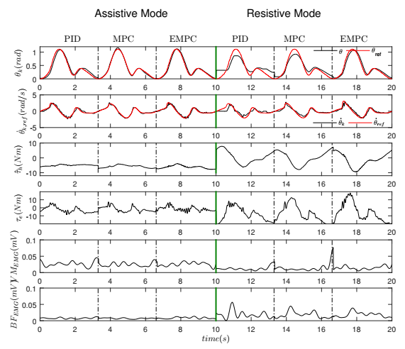
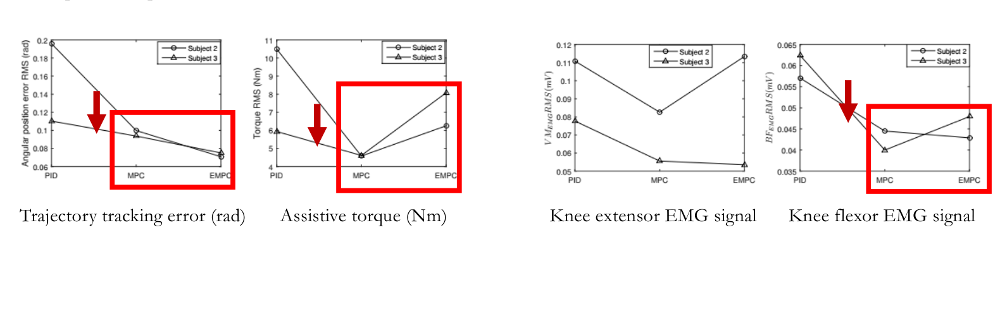

### [{alt="Participant walking with an actuated ankle–foot orthosis"}]{.research-thumbnail .research-thumbnail-media} [Adaptive Mobility Assistance]{.research-theme} [Control of Wearable Robots]{.research-card-title} [Ankle assistance, sit-to-stand support, and knee rehabilitation.]{.research-preview}

#### Control of wearable robots {#wearable-control}

::: {.research-meta}
LISSI · Ankle–foot orthosis / Lower-limb exoskeleton / Knee rehabilitation
:::

The three controllers solve different problems. During walking, the ankle orthosis must follow a gait-dependent reference despite uncertain dynamics. During sit-to-stand, an exoskeleton must share the work with the wearer and prevent loss of balance. During knee rehabilitation, the controller must track a safe trajectory within actuator limits at a short sampling period.

::: {.gait-study}

##### Selectively adaptive fuzzy control for ankle assistance {#control-ankle}

::: {.research-meta}
Actuated ankle–foot orthosis · IEEE Robotics and Automation Letters, 2022
:::

**Control problem.** A fixed ankle trajectory and fixed controller parameters cannot account for changes across gait subphases or time-varying disturbances. Updating a fuzzy controller continuously also expends control effort when its tracking is already adequate.

The design separates **reference generation**, **control adaptation**, and **disturbance handling**. The adaptive ankle reference generator (AARG) sets the desired ankle angle for the current gait subphase. Particle swarm optimization (PSO) initializes the fuzzy controller before walking. During walking, a Lyapunov-based law updates the fuzzy output singletons only when tracking error crosses a half-Gaussian criterion. A supervisory term monitors the response and counters external disturbances.

```{=html}
<figure class="gait-figure">

<figcaption>Controller architecture and selective-update rule.</figcaption>
</figure>
<h6 class="gait-torque-title">What each part does</h6>
```

::: {.gait-torque-methods}
::: {}
**Reference and initialization**

The AARG sets a gait-subphase-dependent ankle target. PSO selects the fuzzy controller's initial membership and output parameters before online control begins.
:::
::: {}
**Online correction**

Measured ankle motion is compared with the target. Large enough error triggers selective parameter updates; a supervisory term compensates disturbances. Small error leaves the fuzzy parameters unchanged.
:::
:::

```{=html}
<div class="gait-system">
<figure class="gait-figure">
<video class="control-demo-video" autoplay muted loop playsinline controls preload="metadata" width="236" height="420" aria-label="HGSA ankle-orthosis treadmill experiment"><source src="videos/HGSA.mp4?v=f38e0ac9" type="video/mp4"><a href="videos/HGSA.mp4?v=f38e0ac9">Download the HGSA experiment video</a>.</video>
<figcaption>HGSA treadmill experiment.</figcaption>
</figure>
<div class="gait-system-notes">
<p><strong>Experimental system</strong></p>
<ul>
<li><strong>FSR insole</strong> identifies foot contact for gait timing.</li>
<li><strong>Orthosis</strong> actuates the ankle; the knee joint remains passive.</li>
<li><strong>Participants</strong> five healthy adults, each walking for two minutes.</li>
</ul>
</div>
</div>
<figure class="gait-figure">

<figcaption>Ankle angle, angular speed, and control torque across the gait cycle. The assisted response (red) is compared with the reference (yellow) and unassisted response (black).</figcaption>
</figure>
<figure class="gait-figure research-compact-figure">

<figcaption>Tracking-error reduction and total control torque across compared controllers.</figcaption>
</figure>
```

The slides report **52% lower average ankle trajectory tracking error** than the unassisted condition and **9.5% less total control torque** than full, continuous adaptation. The two comparisons test different claims: the orthosis improves tracking, while selective adaptation reduces the torque cost of control.

[Read the ankle-control paper](https://doi.org/10.1109/LRA.2022.3191187){.gait-paper-link target="_blank" rel="noopener"}

:::

::: {.gait-study}

##### Impedance modulation for sit-to-stand assistance {#control-sit-to-stand}

::: {.research-meta}
Lower-limb exoskeleton · IEEE Transactions on Robotics, 2022
:::

**Control problem.** A wearer with partial motor ability should still initiate and guide standing up. Simply imposing a fixed joint trajectory can overlook the wearer's effort and the two common failure patterns examined here: falling back onto the chair (*sit-back*) or taking a corrective step. The exoskeleton needs to reduce effort while helping the wearer keep the center of mass (CoM) over a safe region.

The controller begins with the wearer's own movement rather than a prescribed rise. A nonlinear observer estimates the person's hip and knee torques from joint kinematics, without EMG or force sensors. A time-varying admittance model then defines how the coupled person and exoskeleton should move under those torques. The assistance is reduced as the person moves faster or nears standing; a virtual force acts when the center of mass approaches the balance boundary.

```{=html}
<figure class="gait-figure">

<figcaption>Torque estimation, desired admittance and tracking in the sit-to-stand controller.</figcaption>
</figure>
<h6 class="gait-torque-title">Power and balance assistance</h6>
```

::: {.gait-torque-methods}
::: {}
**Active impedance modulation**

The desired admittance sets a lower-effort response to the estimated human torque. CoM height and velocity adapt the level of assistance to the wearer's movement ability.
:::
::: {}
**Balance and tracking**

A virtual environmental force reinforces balance within a safe CoM region. Sliding-mode control commands the actuated joints to track the combined assistance and balance response.
:::
:::

```{=html}
<div class="gait-system">
<figure class="gait-figure">

<figcaption>Experimental exoskeleton.</figcaption>
</figure>
<div class="gait-system-notes">
<p><strong>Component roles</strong></p>
<ul>
<li><strong>Hip and knee</strong> series elastic actuators supply assistance.</li>
<li><strong>Ankle</strong> remains passive.</li>
<li><strong>Wearer</strong> retains control priority; the robot complements available effort and reinforces balance.</li>
</ul>
</div>
</div>
<div class="sts-videos">
<figure><figcaption>Slow</figcaption><video autoplay muted loop playsinline controls preload="metadata" width="405" height="720" aria-label="Slow sit-to-stand trial"><source src="videos/slow_STS.mp4" type="video/mp4"><a href="videos/slow_STS.mp4">Download the slow sit-to-stand video</a>.</video></figure>
<figure><figcaption>Middle</figcaption><video autoplay muted loop playsinline controls preload="metadata" width="405" height="720" aria-label="Middle-speed sit-to-stand trial"><source src="videos/Normal_STS.mp4" type="video/mp4"><a href="videos/Normal_STS.mp4">Download the middle-speed sit-to-stand video</a>.</video></figure>
<figure><figcaption>Sit-back</figcaption><video autoplay muted loop playsinline controls preload="metadata" width="405" height="720" aria-label="Sit-back trial"><source src="videos/Sitback_STS.mp4" type="video/mp4"><a href="videos/Sitback_STS.mp4">Download the sit-back video</a>.</video></figure>
<figure><figcaption>Step</figcaption><video autoplay muted loop playsinline controls preload="metadata" width="405" height="720" aria-label="Stepping trial"><source src="videos/Step_STS.mp4" type="video/mp4"><a href="videos/Step_STS.mp4">Download the stepping video</a>.</video></figure>
</div>
<figure class="gait-figure sts-plots">
<div class="sts-plots-crop"></div>
<figcaption>Measured joint and torque responses for the four patterns.</figcaption>
</figure>
```

Four healthy participants performed slow and medium-speed rises and the sit-back and step variants. The last two deliberately challenge balance rather than testing only an ideal rise. The paper reports appropriate power assistance and balance reinforcement across these tasks; the selected slides do not provide one aggregate percentage improvement.

[Read the sit-to-stand paper](https://doi.org/10.1109/TRO.2021.3104244){.gait-paper-link target="_blank" rel="noopener"}

:::

::: {.gait-study}

##### Explicit model predictive control for knee rehabilitation {#control-knee}

::: {.research-meta}
Knee exoskeleton · IEEE/ASME Transactions on Mechatronics, 2022
:::

**Control problem.** A knee orthosis must track a rehabilitation trajectory while accounting for the wearer's torque and limits on its input and motion. Conventional model predictive control (MPC) repeatedly solves an optimization problem online; the small sampling period needed for walking makes that computation difficult to fit into real time.

The controller links a desired knee trajectory to a model of the wearer and orthosis. Least-squares identification estimates dynamic parameters; a nonlinear disturbance observer estimates wearer torque and outside disturbances. Exact input-to-state feedback linearization makes the model suitable for constrained prediction. Conventional MPC solves for a new action at each step, while **explicit MPC** precomputes the constrained control law offline and looks up the appropriate action online. Lyapunov analysis addresses closed-loop stability.

```{=html}
<figure class="gait-figure">

<figcaption>Predictive knee-control architecture, including the disturbance observer and input/output constraints.</figcaption>
</figure>
<h6 class="gait-torque-title">From model to real-time assistance</h6>
```

::: {.gait-torque-methods}
::: {}
**Identify and estimate**

A fixed-time generator supplies the knee reference. Least squares identifies the exoskeleton dynamics; the observer estimates the wearer's torque so the controller can respond to human–robot interaction.
:::
::: {}
**Predict within limits**

MPC accounts for input and output constraints. Explicit MPC stores its solution as an offline lookup table, avoiding a full optimization at each short walking sample.
:::
:::

```{=html}
<div class="empc-comparison">
<figure class="gait-figure research-compact-figure">
<video class="control-demo-video" autoplay muted loop playsinline controls preload="metadata" width="360" height="640" aria-label="Treadmill test with a knee rehabilitation exoskeleton"><source src="videos/EMPC_video.avi.mp4" type="video/mp4"><a href="videos/EMPC_video.avi.mp4">Download the EMPC experiment video</a>.</video>
<figcaption>Treadmill experiment with the knee rehabilitation exoskeleton.</figcaption>
</figure>
<figure class="gait-figure">
<a href="images/control-knee-seated-modes.png" target="_blank" rel="noopener" aria-label="Open the seated PID, MPC and EMPC comparison at full size"></a>
<figcaption>Seated comparison of PID, MPC, and EMPC: the participant followed the assistance in assistive mode and intentionally resisted it in resistive mode.</figcaption>
</figure>
</div>
```

A separate treadmill test included two healthy participants walking while imitating abnormal gait with an active knee orthosis and IMUs. Trajectory error, assistance demand, and muscle activity were measured.

```{=html}
<figure class="gait-figure">

<figcaption>PID, MPC and explicit MPC comparison: knee-angle error, assistive torque, knee-extensor EMG and biceps femoris EMG.</figcaption>
</figure>
```

Both predictive variants improve trajectory tracking and reduce energy consumption relative to PID in the reported tests. The knee-flexor (biceps femoris) EMG signal is also lower. The slide does not establish a single best controller for every measure, so the result is presented as the comparison shown rather than a blanket ranking.

[Read the knee-control paper](https://doi.org/10.1109/TMECH.2021.3126674){.gait-paper-link target="_blank" rel="noopener"}

:::

**Related work**

- [Selectively Adaptive Fuzzy Ankle Control (IEEE RA-L, 2022)](https://doi.org/10.1109/LRA.2022.3191187)
- [Sit-to-Stand Exoskeleton Control (IEEE T-RO, 2022)](https://doi.org/10.1109/TRO.2021.3104244)
- [Explicit MPC for Knee Rehabilitation (IEEE/ASME T-Mech, 2022)](https://doi.org/10.1109/TMECH.2021.3126674)
- [Funnel-Based Adaptive Fuzzy Ankle Control (ICRA, 2024)](https://doi.org/10.1109/ICRA57147.2024.10610584){#control-funnel}
- [Adaptive Neural Ankle–Foot Orthosis Control (IEEE T-ASE, 2026)](https://doi.org/10.1109/TASE.2026.3718534){#control-neural}
