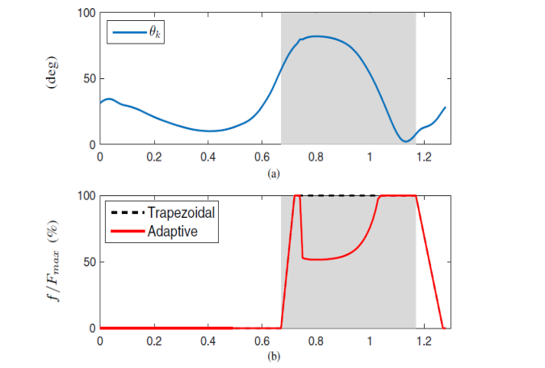
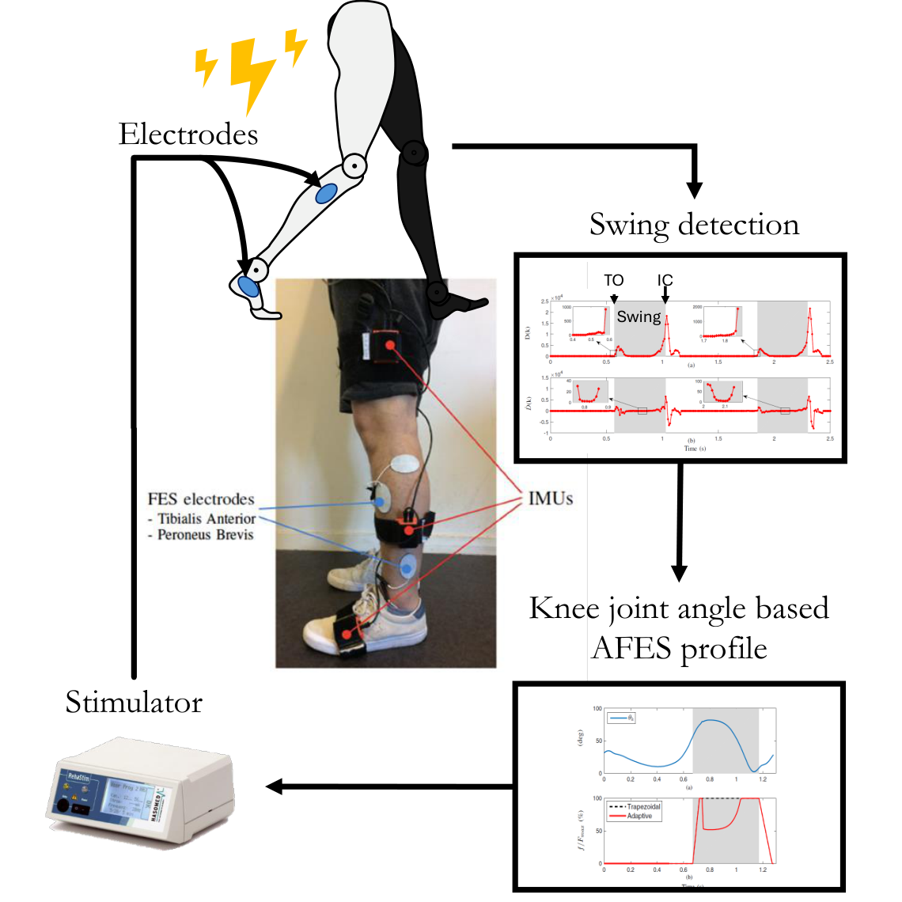
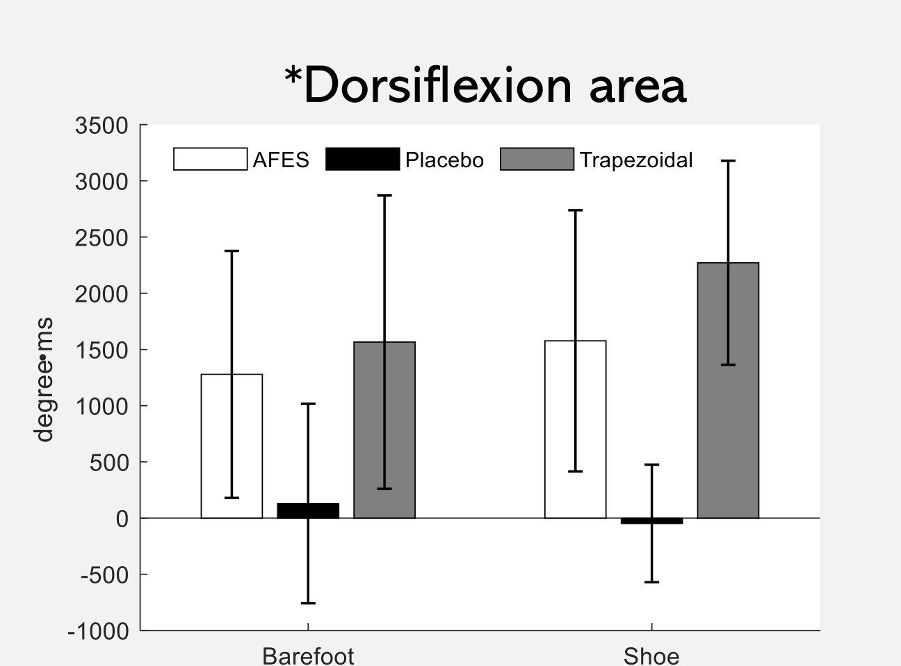

### [{alt="Knee angle and knee-guided FES stimulation profiles from the research poster"}]{.research-thumbnail .research-thumbnail-media} [Adaptive Mobility Assistance]{.research-theme} [Functional Electrical Stimulation]{.research-card-title} [Latest closed-loop study under review.]{.research-preview}

#### Adaptive FES for foot drop {#adaptive-fes}

::: {.research-meta}
LISSI · Functional electrical stimulation
:::

Foot drop makes it difficult to clear the ground during swing. Functional electrical stimulation (FES) can activate the muscles that lift the foot, but a fixed ON/OFF or trapezoidal pulse does not account for how the knee moves through swing. My first AFES study used knee angle to shape stimulation **within each step**. The follow-on closed-loop study also changes stimulation magnitude and late-swing timing **between steps**, using the wearer's unaffected ankle as a personal reference.

::: {.gait-study}

##### Knee-angle-based adaptive FES

::: {.research-meta}
Method: IEEE/RSJ IROS, 2018 · Clinical evaluation: research poster
:::

**Why knee motion matters.** Stimulation needs to lift the foot after toe-off, but knee re-extension near initial contact can stretch the gastrocnemius and oppose ankle dorsiflexion. Keeping stimulation high throughout swing may therefore use current when less is needed. The adaptive profile raises stimulation in initial and terminal swing and relaxes it around peak knee flexion in mid swing.

```{=html}
<div class="fes-system-demo">
<figure class="gait-figure fes-profile-figure">

<figcaption>The knee-guided profile reduces stimulation around mid swing and increases it again as the knee re-extends.</figcaption>
</figure>
<figure class="gait-figure fes-experiment-figure">
<video class="gait-video" autoplay muted loop playsinline controls preload="metadata" width="776" height="720" aria-label="Adaptive FES walking experiment with swing, knee angle, and stimulation plots"><source src="videos/FES_exp.mp4?v=cbc678ed" type="video/mp4"><a href="videos/FES_exp.mp4?v=cbc678ed">Download the adaptive FES experiment video</a>.</video>
<figcaption>Walking experiment with live swing, knee-angle, and stimulation plots.</figcaption>
</figure>
</div>
<h6 class="gait-torque-title">How stimulation is generated</h6>
```

::: {.gait-torque-methods}
::: {}
**1 · Detect the swing window**

Wearable IMUs detect toe-off (TO) and initial contact (IC). Stimulation is active during the intervening swing phase; the measured knee angle provides the continuous signal that shapes its intensity.
:::
::: {}
**2 · Shape and deliver the pulse**

The knee angle scales current between calibrated minimum and maximum levels. Current falls toward its minimum near peak knee flexion, then rises as the knee re-extends. Short ramps smooth the transitions after TO and IC.
:::
:::

```{=html}
<figure class="gait-figure fes-system-figure">
<a href="images/fes-system-flow.png" target="_blank" rel="noopener" aria-label="Open the FES system diagram at full size">

</a>
<figcaption>System flow: IMUs identify the swing interval and knee angle; the resulting profile drives stimulation through electrodes on the tibialis anterior and peroneus brevis.</figcaption>
</figure>
```

##### Clinical evaluation

The poster reports 10-m walking tests with three groups of people with hemiplegia and foot drop: AFES (6 participants), placebo (4), and trapezoidal FES (5).

```{=html}
<div class="gait-table-wrap">
<table class="gait-table fes-line">
<caption>Clinical study timeline</caption>
<thead><tr><th scope="col">When</th><th scope="col">Protocol</th></tr></thead>
<tbody>
<tr><th scope="row">Day 1</th><td>Baseline 10-m walking evaluation</td></tr>
<tr><th scope="row">Weeks 1–12</th><td>45-minute walking-training sessions with the assigned condition</td></tr>
<tr><th scope="row">Week 12</th><td>Post-training evaluation</td></tr>
<tr><th scope="row">Weeks 12–24</th><td>No stimulation</td></tr>
<tr><th scope="row">Week 24</th><td>Follow-up evaluation</td></tr>
</tbody>
</table>
</div>
```

```{=html}
<figure class="gait-figure research-compact-figure fes-clinical-figure">

<figcaption>Dorsiflexion area in the barefoot and shoe conditions.</figcaption>
</figure>
```

The AFES group achieved a dorsiflexion-area measure of **1278°·ms barefoot** and **1577°·ms in shoes**. Its dorsiflexion area exceeded the placebo group's ($p < 0.005$) and was statistically similar to the trapezoidal group's ($p > 0.05$). Relative to trapezoidal FES, the poster reports **18.6% less stimulation energy barefoot** and **20.4% less in shoes**. The selected research slides likewise report comparable mid- and late-swing dorsiflexion with lower stimulation intensity.

[Method paper (IROS 2018)](https://doi.org/10.1109/IROS.2018.8594051){.gait-paper-link target="_blank" rel="noopener"}

:::

::: {.gait-study}

##### Closed-loop FES with phase–magnitude adaptation for drop-foot correction {#fes-phase-magnitude}

::: {.research-meta}
[Under review]{.fes-status} 2026
:::

The first AFES profile changes shape within a swing, but its peak intensity and late-swing restoration timing remain fixed from one step to the next. This follow-on method uses the patient's **unaffected ankle** as a subject-specific reference. IMUs segment each leg's swing independently; after a valid bilateral pair of swings, the ankle trajectories are normalized to the same 0–100% swing scale and compared. The controller updates two different parameters for the next affected-side swing.

```{=html}
<h6 class="gait-torque-title">Two separate adaptation rules</h6>
```

::: {.gait-torque-methods}
::: {}
**Magnitude · how much stimulation**

After compensating for phase lag, a terminal-swing dorsiflexion difference adjusts the peak stimulation level. If the affected ankle still dorsiflexes less, the rule can increase the next pulse within the calibrated range.
:::
::: {}
**Phase · when stimulation returns**

A lead or lag between the ankle trajectories changes the knee-angle threshold at which stimulation rises again in late swing. Small errors inside a deadband do not trigger an update; an invalid bilateral cycle retains the previous settings.
:::
:::

```{=html}
<div class="gait-table-wrap">
<table class="gait-table fes-line">
<caption>Experimental protocol</caption>
<thead><tr><th scope="col">Item</th><th scope="col">Description</th></tr></thead>
<tbody>
<tr><th scope="row">Participants</th><td>5 people with post-stroke hemiparesis and foot drop</td></tr>
<tr><th scope="row">Walking</th><td>Level ground, slow and fast speed</td></tr>
<tr><th scope="row">Conditions</th><td>No stimulation, trapezoidal FES, fixed-parameter AFES, proposed method</td></tr>
<tr><th scope="row">Sensors</th><td>IMUs on both lower limbs; surface electrodes on the affected-side tibialis anterior</td></tr>
</tbody>
</table>
</div>
<h6 class="gait-torque-title">Participant-level outcomes</h6>
```

```{=html}
<div class="gait-table-wrap">
<table class="gait-table gait-comparison">
<caption>Ankle-angle mean absolute error, mean ± SD (degrees); five participants</caption>
<thead><tr><th scope="col">Condition</th><th scope="col">Slow walking</th><th scope="col">Faster walking</th></tr></thead>
<tbody>
<tr><th scope="row">No FES</th><td>7.192 ± 1.750</td><td>6.218 ± 1.870</td></tr>
<tr><th scope="row">Trapezoidal FES</th><td>3.426 ± 0.449</td><td>3.675 ± 1.498</td></tr>
<tr><th scope="row">Fixed-parameter AFES</th><td>4.655 ± 0.930</td><td>3.746 ± 0.804</td></tr>
<tr class="gait-proposed"><th scope="row">Phase–magnitude AFES</th><td>2.302 ± 0.518</td><td>2.509 ± 0.618</td></tr>
</tbody>
</table>
</div>
```

The proposed method had the lowest mean bilateral ankle-angle error at both speeds. The submitted manuscript also reports the highest ankle-trajectory similarity and lower stride-to-stride error variation. Its fixed-parameter AFES comparator shared the same initial settings but was not individually optimized; the results should be read in that context. These are outcomes from the **five-participant study under review**, separate from the earlier 12-week clinical poster.

:::

**Related work**

- [Adaptive FES with Gait-Phase Detection (IROS, 2018)](https://doi.org/10.1109/IROS.2018.8594051)
- [Hybrid FES–Orthosis Foot-Drop Assistance (ICRA, 2021)](https://doi.org/10.1109/ICRA48506.2021.9561497)
- Phase–Magnitude Adaptive FES for Foot Drop (IEEE TNSRE, 2026; under review)
