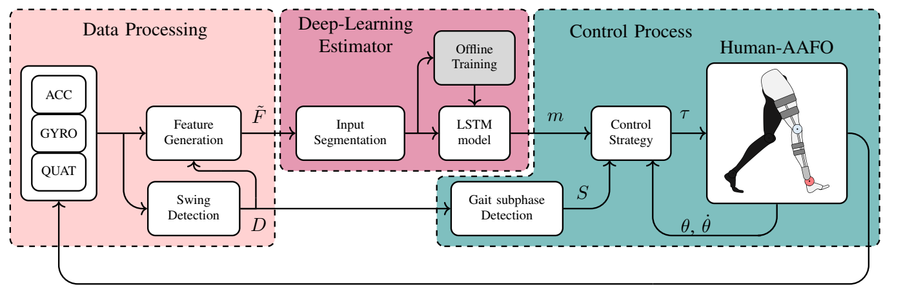
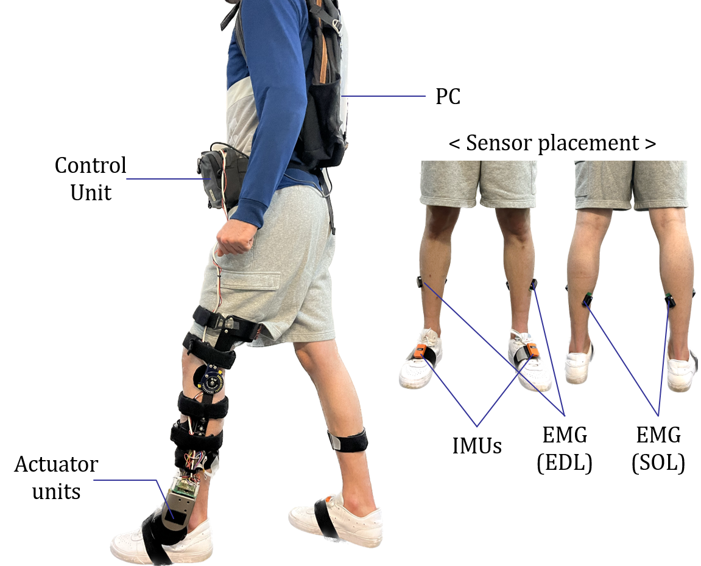
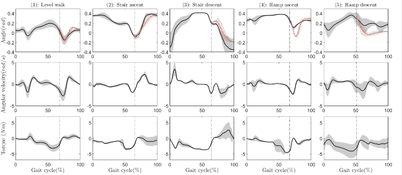
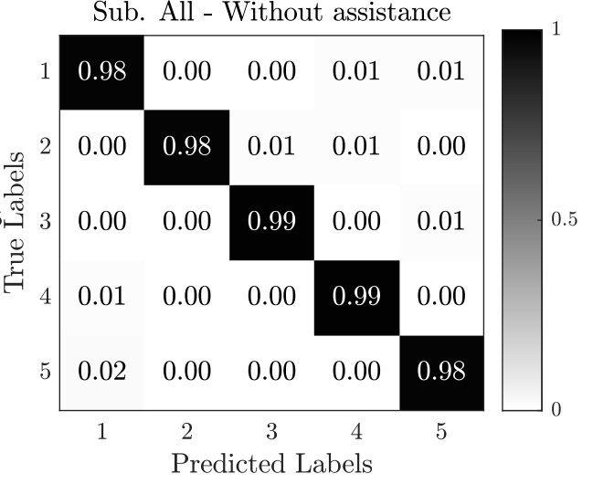
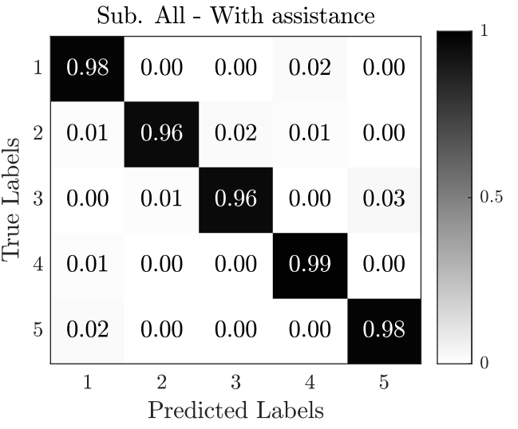
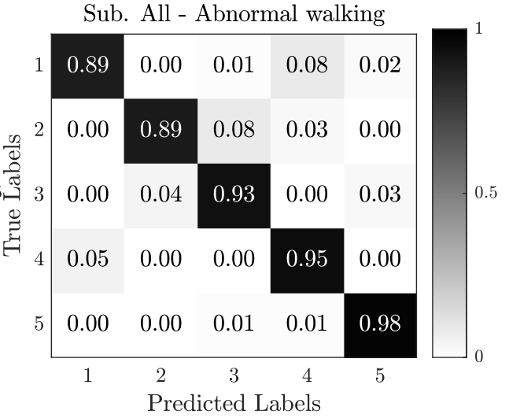
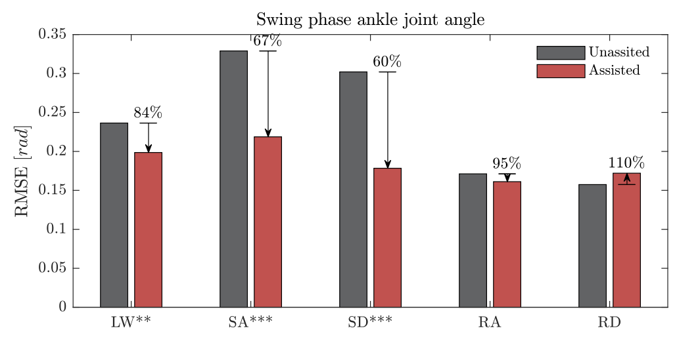
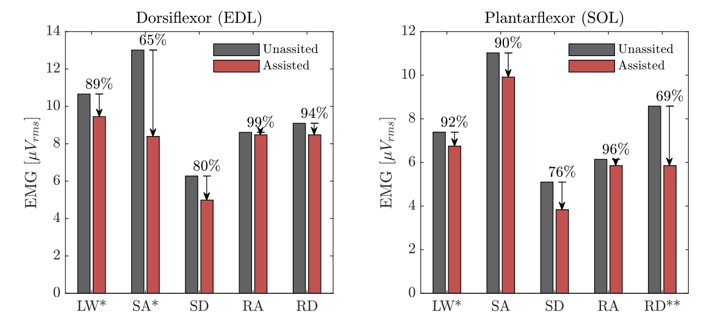

### [{alt="Data processing, LSTM estimator and orthosis control pipeline"}]{.research-thumbnail .research-thumbnail-media} [Human Motion Understanding]{.research-theme} [Locomotion intention]{.research-card-title} [Recognising the walking terrain from two foot IMUs.]{.research-preview}

#### Locomotion intention detection {#gait-intent}

::: {.research-meta}
LISSI · Wearable sensing / Deep learning
:::

Level walking, stairs and ramps involve different ankle movements and moments. An actuated ankle–foot orthosis therefore needs to identify the walking mode before selecting the appropriate assistance. Manual mode switching can be difficult for people with limited motor control, while rule-based detection requires hand-tuned rules. This study tests whether two foot-mounted IMUs and an LSTM can recognise five walking modes in real time and switch the orthosis controller accordingly.

::: {.gait-study}

##### Real-time LSTM-driven gait mode detection for an actuated ankle–foot orthosis

::: {.research-meta}
IEEE Transactions on Robotics, 2025
:::

```{=html}
<figure class="gait-figure">

<figcaption>Pipeline: IMU data processing and swing detection, the LSTM estimator, and mode-dependent control of the orthosis.</figcaption>
</figure>
```

```{=html}
<div class="gait-system">
<figure class="gait-figure">

<figcaption>System configuration</figcaption>
</figure>
<div class="gait-system-notes">
<p><strong>Component roles</strong></p>
<ul>
<li><strong>IMUs</strong> — one per foot; motion signals drive swing detection and LSTM gait-mode classification.</li>
<li><strong>AAFO</strong> — mode-specific dorsiflexion and plantarflexion assistance: impedance control in stance and trajectory tracking in swing.</li>
<li><strong>EMG</strong> — EDL (front/outer shin) and SOL (rear calf) electrodes record muscle activity to evaluate assistance.</li>
</ul>
</div>
</div>
```

```{=html}
<h6 class="gait-torque-title">Torque generation</h6>
```

::: {.gait-torque-methods}
::: {}
**Stance · impedance modulation**

Virtual stiffness $k$, equilibrium angle $\theta_0$ and damping $b$ set the ankle torque: $\tau=-k(\theta-\theta_0)-b\dot\theta$. The torque responds to ankle angle and velocity.
:::
::: {}
**Swing · trajectory tracking**

Four ankle-angle key points for the detected gait mode are interpolated into a reference trajectory. PID tracking commands the AAFO torque needed to follow it.
:::
:::

```{=html}
<figure class="gait-figure gait-torque-profiles">

<figcaption>Ankle angle, angular velocity and torque profiles across the five walking modes.</figcaption>
</figure>
```

<div class="gait-table-wrap">
<table class="gait-table gait-comparison">
<caption>Offline sequence accuracy, 10 subjects</caption>
<thead><tr><th scope="col">Method</th><th scope="col">Accuracy, mean ± SD (%)</th><th scope="col">F-measure</th></tr></thead>
<tbody>
<tr><th scope="row">k-nearest neighbours</th><td>92.8 ± 1.8</td><td>0.94</td></tr>
<tr><th scope="row">Support vector machine</th><td>93.3 ± 2.0</td><td>0.94</td></tr>
<tr><th scope="row">Random forest</th><td>94.2 ± 1.9</td><td>0.96</td></tr>
<tr><th scope="row">Gradient boosting</th><td>93.2 ± 2.0</td><td>0.94</td></tr>
<tr class="gait-proposed"><th scope="row">LSTM (proposed)</th><td>98.7 ± 0.6</td><td>0.98</td></tr>
</tbody>
</table>
</div>

```{=html}
<figure class="gait-figure">
<div class="gait-figure-grid gait-matrices">



</div>
<figcaption>Real-time confusion matrices (row-normalised) over all subjects. Under the mimicked abnormal gait, shortened strides cause some level walking to be read as ramp ascent.</figcaption>
</figure>
```

```{=html}
<p><strong>Main experimental result</strong></p>
<video class="gait-video" autoplay muted loop playsinline controls preload="metadata" poster="images/gait-main-video-poster.png" width="1280" height="720" aria-label="Real-time gait mode detection and control experiment">
<source src="videos/Experimental_Video_RT_GMD_Control.mp4" type="video/mp4">
<a href="videos/Experimental_Video_RT_GMD_Control.mp4">Download the experimental video</a>.
</video>
```

```{=html}
<div class="gait-figure-grid gait-charts">
<figure class="gait-figure">

<figcaption>Swing-phase ankle joint angle tracking error with and without assistance.</figcaption>
</figure>

<figure class="gait-figure">

<figcaption>EDL and SOL muscle activity with and without assistance.</figcaption>
</figure>
</div>
```

```{=html}
<p><strong>Real-life scenarios</strong></p>
<video class="gait-video" autoplay muted loop playsinline controls preload="metadata" width="1280" height="720" aria-label="Walking on different terrains">
<source src="videos/Various_walking_two.mp4" type="video/mp4">
<a href="videos/Various_walking_two.mp4">Download the walking video</a>.
</video>
```

[Paper](https://doi.org/10.1109/TRO.2025.3593111){.gait-paper-link target="_blank" rel="noopener"}

:::

**Related work**

- [Real-Time LSTM-Driven Dynamic Gait Mode Detection (IEEE T-RO, 2025)](https://doi.org/10.1109/TRO.2025.3593111)
- [Online Human Intention Detection (Humanoids, 2022)](https://doi.org/10.1109/Humanoids53995.2022.10000150){#gait-online-intention}
- [Fuzzy Convolutional Attention-based GRU Network (EAAI, 2023)](https://doi.org/10.1016/j.engappai.2022.105702){#gait-fcagru}
