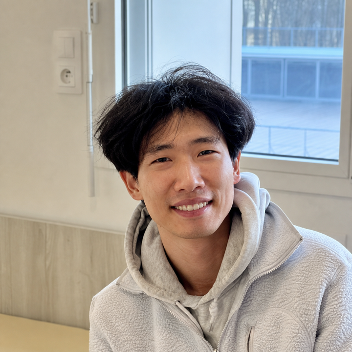

::: {.hero}
::: {.hero-text}

Huiseok Moon

Postdoctoral Researcher · <a href="https://www.lissi.fr/accueil/" target="_blank" rel="noopener">Laboratoire Images, Signaux et Systèmes Intelligents (LISSI)</a> · Université Paris-Est Créteil

::: {.hero-content}

At <a href="https://www.lissi.fr/accueil/" target="_blank" rel="noopener">LISSI</a>, Université Paris-Est Créteil, I work with Prof. Samer Mohammed on
assistive robotics and physical human-robot interaction. I use wearable EMG
and IMU signals to infer human intent for safe, adaptive mobility assistance.

I completed my Ph.D. in Signal, Image and Control at Université Paris-Est
Créteil under Prof. Mohammed. My thesis examined human-in-the-loop approaches
to mobility assistance with powered exoskeletons. Before that, I earned an
M.S. in Mechanical Engineering from Sogang University, where Prof. Kyoungchul
Kong advised my work on lower-limb exoskeleton control for load-carrying
tasks.

::: {.hero-photo}
{alt="Portrait of Huiseok Moon"}
:::
:::

<a class="hero-email" href="mailto:huiseok.moon@u-pec.fr">huiseok.moon@u-pec.fr</a>

:::
:::
