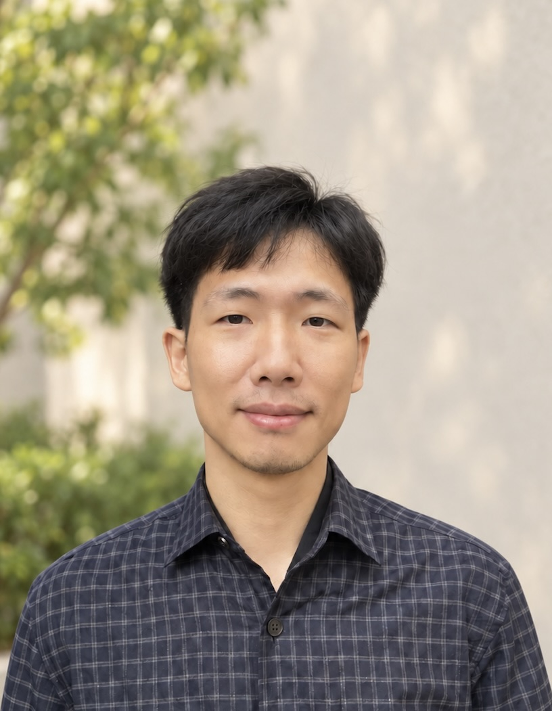

::: {.hero}
::: {.hero-text}

Huiseok Moon

Postdoctoral Researcher · <a href="https://www.lissi.fr/accueil/" target="_blank" rel="noopener">Laboratoire Images, Signaux et Systèmes Intelligents (LISSI)</a> · Université Paris-Est Créteil

::: {.hero-content}

I develop wearable robots and sensing systems that respond to how people move. My work connects machine learning with robot control: using wearable signals to recognize walking conditions, estimate joint moments, and adapt physical assistance to the wearer.

I work across algorithms, hardware, and experiments with human participants. My experience includes lower-limb exoskeleton control, electrical stimulation for foot-drop assistance, and gait assessment after stroke. I now develop models that capture patterns across walking conditions, with the aim of making assistance more responsive to changes in a person’s movement.

I received my Ph.D. in Signal, Image and Control from Université Paris-Est Créteil in 2024, advised by Samer Mohammed, and my M.S. in Mechanical Engineering from Sogang University in 2019, advised by Kyoungchul Kong. Before my current position, I was a postdoctoral researcher at KAIST, where I worked on physics-informed human movement analysis and representation learning.

::: {.hero-photo}
{alt="Portrait of Huiseok Moon"}
:::
:::

<a class="hero-email" href="mailto:huiseok.moon@u-pec.fr">huiseok.moon@u-pec.fr</a>

:::
:::
