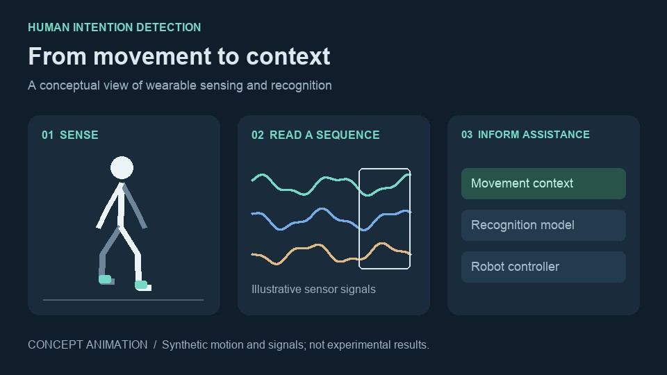
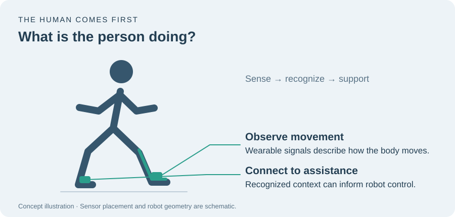
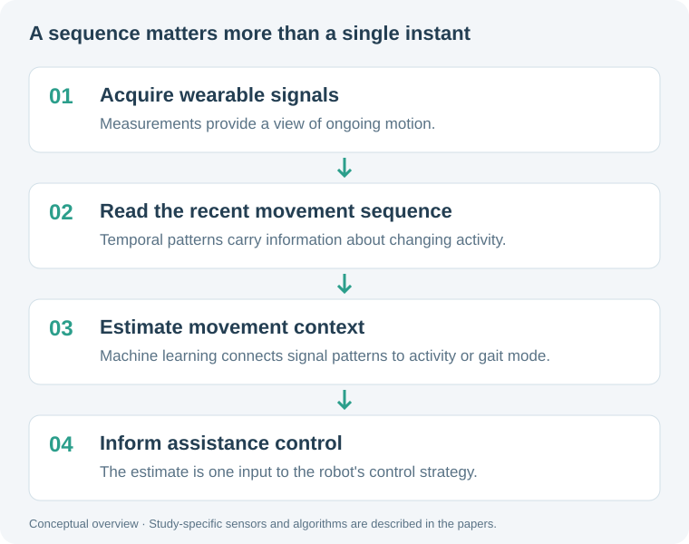

::: {.page-intro}
I study how wearable robots can understand and support human movement.
My work connects human intent recognition from EMG and IMU signals with
adaptive control for mobility assistance and rehabilitation. At LISSI,
Université Paris-Est Créteil, I work on assistive robotics and physical
human–robot interaction, building on my research at KAIST and Sogang University.
:::

## Selected research

Choose a research card to explore the work and related publications.

<!-- Replace video placeholders with real videos; see _research-media.md. -->

<button type="button" id="research-overview" hidden>← All research</button>

::: {.panel-tabset .research-tabs}

### [{alt="Human intention detection concept animation preview"}]{.research-thumbnail .research-thumbnail-media} [Human intention detection]{.research-card-title} [From wearable signals to movement-aware assistance.]{.research-preview}

#### Understanding movement before choosing assistance

::: {.research-meta}
LISSI · Human intention detection / Wearable sensing / Machine learning
:::

A wearable robot needs more than a joint position: it needs context about the person's movement. My research studies how wearable signals can help recognize activity and gait mode, connecting human movement understanding with lower-limb robotic assistance.


```{=html}
<figure class="intent-story">

<figcaption>Movement is the starting point. This original illustration shows the sensing–assistance relationship; it is not a photograph of the experimental setup.</figcaption>
</figure>
```

##### Why movement context matters

Walking and changing activity produce evolving signal patterns. The aim is to interpret those patterns online, so that a wearable robot's controller can take the person's movement context into account. Here, “intention” refers to movement-related information inferred from sensor signals, rather than a direct measurement of a person's thoughts.

##### The idea in eight seconds

```{=html}
<figure class="intent-story">
<video controls muted loop playsinline preload="none" poster="images/intent-poster.jpg" width="960" height="540" aria-label="Eight-second conceptual animation of sensing, sequence recognition and robot assistance">
<source src="videos/intent-concept.mp4" type="video/mp4">
<a href="videos/intent-concept.mp4">Watch the concept animation</a>
</video>
<figcaption>A silent concept animation: body movement → changing sensor signals → movement context for assistance. Motion and waveforms are synthetic illustrations, not recorded experiments or model predictions.</figcaption>
</figure>
```

##### How the pieces connect

```{=html}
<figure class="intent-story">

<figcaption>The common research question is how to turn a sequence of wearable measurements into information useful for assistance. Each paper addresses a specific part of that question.</figcaption>
</figure>
```

##### My research across three studies

**Online intention detection.** My Humanoids 2022 paper investigates machine-learning-based online human intention detection for lower-limb wearable robot control.

**Temporal gait recognition.** My IEEE T-RO 2025 work focuses on real-time, LSTM-driven dynamic gait mode detection for an actuated ankle-foot orthosis. It connects sequence-based recognition to the context needed for wearable assistance.

**Related activity recognition.** The collaborative EAAI 2023 study explores a fuzzy convolutional attention-based GRU network for human activity recognition. This is a related recognition study, not an additional stage of the same robot system.

These visuals explain the research direction. They do not report accuracy, detection delay, or clinical outcomes; study-specific methods and evaluations are available in the publications below.


**Related work**

- [Online Human Intention Detection (Humanoids, 2022)](https://doi.org/10.1109/Humanoids53995.2022.10000150)
- [Real-Time LSTM-Driven Dynamic Gait Mode Detection (IEEE T-RO, 2025)](https://doi.org/10.1109/TRO.2025.3593111)
- [Fuzzy Convolutional Attention-based GRU Network (EAAI, 2023)](https://doi.org/10.1016/j.engappai.2022.105702)

### [[02 · CONTROL]{.research-kicker} [DEMO]{.research-demo} [Video coming soon]{.research-badge}]{.research-thumbnail} [Adaptive exoskeletons]{.research-card-title} [Adapting robotic assistance to movement.]{.research-preview}

#### Adaptive control for wearable robots

::: {.research-meta}
LISSI · Nonlinear control / Human–robot interaction
:::

Wearable robots operate in direct contact with a person, making the interaction between human movement and robotic assistance central to their control. My research includes adaptive fuzzy control of actuated ankle-foot orthoses and nonlinear control architectures for lower-limb assistance.

Collaborative work also examines impedance modulation for sit-to-stand assistance and explicit model predictive control for knee rehabilitation. These projects address different movements within the broader goal of human-in-the-loop mobility assistance.

::: {.research-video-placeholder}
**Demo video · Coming soon**

Adaptive exoskeletons — demonstration video to be added.
:::

**Related work**

- [Hybrid Half-Gaussian Selectively Adaptive Fuzzy Control (IEEE RA-L, 2022)](https://doi.org/10.1109/LRA.2022.3191187)
- [Impedance Modulation for Sit-to-Stand Movements (IEEE T-RO, 2022)](https://doi.org/10.1109/TRO.2021.3104244)
- [Assistive Explicit Model Predictive Control (IEEE/ASME T-Mech, 2022)](https://doi.org/10.1109/TMECH.2021.3126674)

### [[03 · REHABILITATION]{.research-kicker} [DEMO]{.research-demo} [Video coming soon]{.research-badge}]{.research-thumbnail} [Adaptive stimulation]{.research-card-title} [Coordinating muscle stimulation with gait.]{.research-preview}

#### Functional electrical stimulation for mobility assistance

::: {.research-meta}
LISSI · EMG / Functional electrical stimulation
:::

My work on functional electrical stimulation (FES) explores how stimulation can adapt to movement and muscle activity. I have developed adaptive control strategies based on surface EMG, with attention to stimulation energy and muscle fatigue.

Related research investigates gait phase detection for combined FES–orthosis assistance and knee-guided adaptive stimulation for drop-foot correction. The latter is described in a submitted manuscript and remains under review.

::: {.research-video-placeholder}
**Demo video · Coming soon**

Adaptive stimulation — demonstration video to be added.
:::

**Related work**

- [Gait Phase Detection for Hybrid FES–Orthosis Assistance (ICRA, 2021)](https://doi.org/10.1109/ICRA48506.2021.9561497)
- Knee-Guided Phase–Magnitude Decoupled Adaptive Functional Electrical Stimulation for Drop-Foot Correction — submitted to IEEE TNSRE, 2026; equal contribution as first and corresponding author.

### [[04 · CLINICAL SENSING]{.research-kicker} [DEMO]{.research-demo} [Video coming soon]{.research-badge}]{.research-thumbnail} [Wearable gait analysis]{.research-card-title} [Understanding mobility beyond the robot.]{.research-preview}

#### Multi-sensor gait analysis

::: {.research-meta}
LISSI · Sensor fusion / Lower-limb kinematics
:::

I have implemented a seven-IMU sensor fusion framework for lower-limb joint analysis in a portable clinical device, with applications to gait assessment and Parkinson’s disease diagnosis.

My collaborative rehabilitation research also examines walking speed, step length, and lower-limb kinematics in hemiparetic patients over eight weeks of guided self-rehabilitation. This study is currently a submitted manuscript.

::: {.research-video-placeholder}
**Demo video · Coming soon**

Wearable gait analysis — demonstration video to be added.
:::

**Related work**

Changes in Walking Speed, Step Length, and Lower Limb Kinematics Over Eight Weeks of Guided Self-Rehabilitation Contracts in Hemiparetic Patients: A Prospective Cohort Study — submitted to Journal of Neural Engineering, 2026.

### [[05 · MOTION INTELLIGENCE]{.research-kicker} [DEMO]{.research-demo} [Video coming soon]{.research-badge}]{.research-thumbnail} [Physics-informed AI]{.research-card-title} [Connecting motion primitives and intent.]{.research-preview}

#### Physics-informed models of human motion intent

::: {.research-meta}
KAIST · Postdoctoral research · September 2025–March 2026
:::

At KAIST, I worked with Prof. Jaegul Choo on physics-informed AI models for human motion intention inference. This research used motion-primitive representations of wearable IMU signals to study human movement intent.

This direction connects my experience in wearable sensing and robotic control with my interest in physics-based modeling and multimodal learning for understanding and predicting human motion.

::: {.research-video-placeholder}
**Demo video · Coming soon**

Physics-informed AI — demonstration video to be added.
:::

**Related work**

[Research background in my CV](cv.qmd)

### [[06 · HUMAN–ROBOT INTERACTION]{.research-kicker} [DEMO]{.research-demo} [Video coming soon]{.research-badge}]{.research-thumbnail} [Load-carrying robots]{.research-card-title} [Managing forces between a person and a load.]{.research-preview}

#### Interaction force control for load carrying

::: {.research-meta}
Sogang University · Master’s research · March 2017–February 2019
:::

During my master’s research with Prof. Kyoungchul Kong, I studied interaction force control for lower-limb exoskeletons used in load-carrying tasks. My thesis focused on a robotic leg control algorithm for reducing the interaction force between a load and the human body.

This work established the human–robot interaction perspective that continues through my research on powered exoskeletons and mobility assistance.

::: {.research-video-placeholder}
**Demo video · Coming soon**

Load-carrying robots — demonstration video to be added.
:::

**Related work**

Control Algorithm of a Robotic Leg for Reducing Interaction Force Between a Load and the Human Body — Master’s thesis, Sogang University, 2019.

:::

[View all publications](publications.qmd) · [View my CV](cv.qmd)
