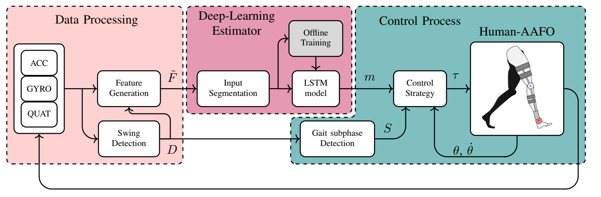
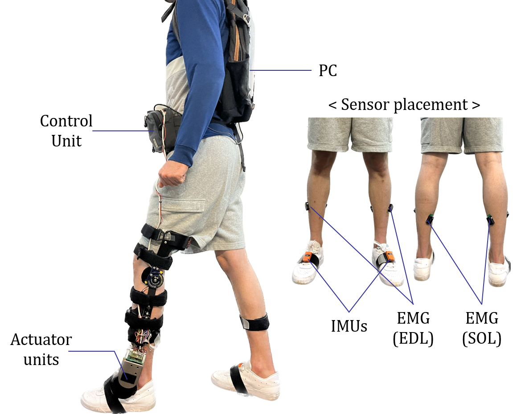
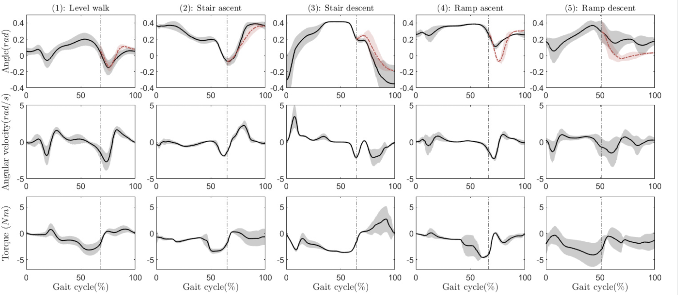
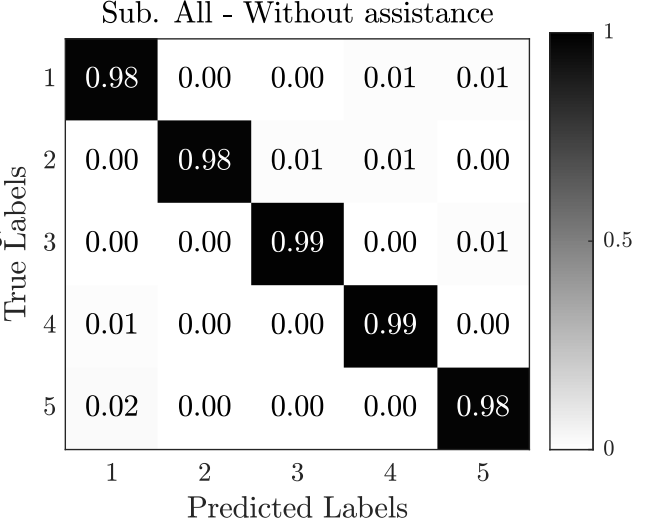
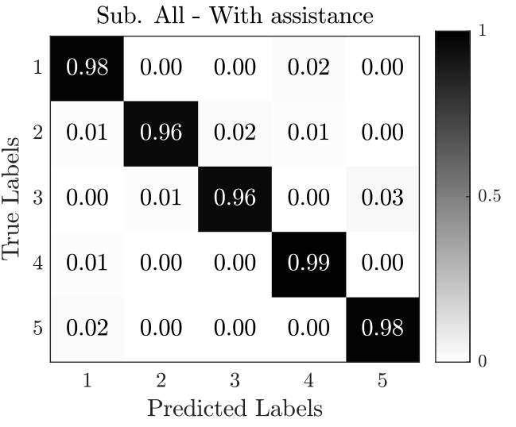
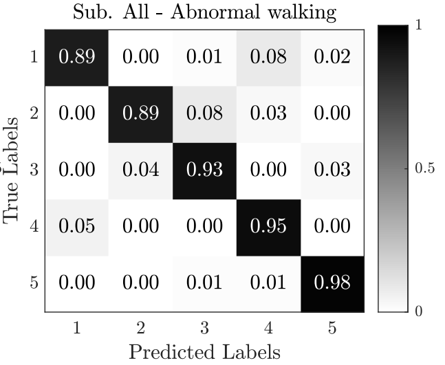
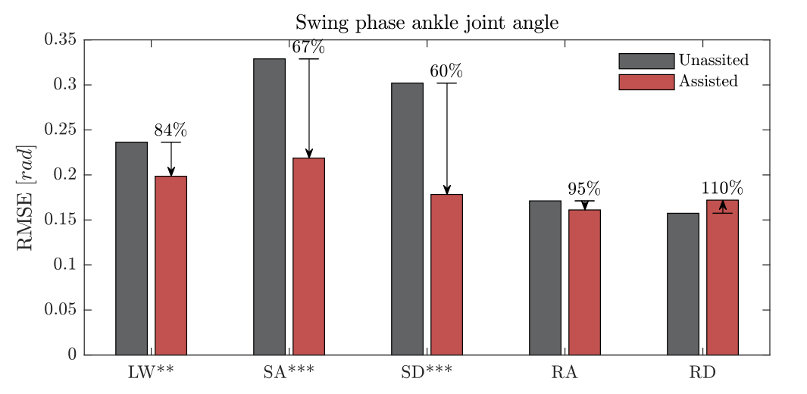
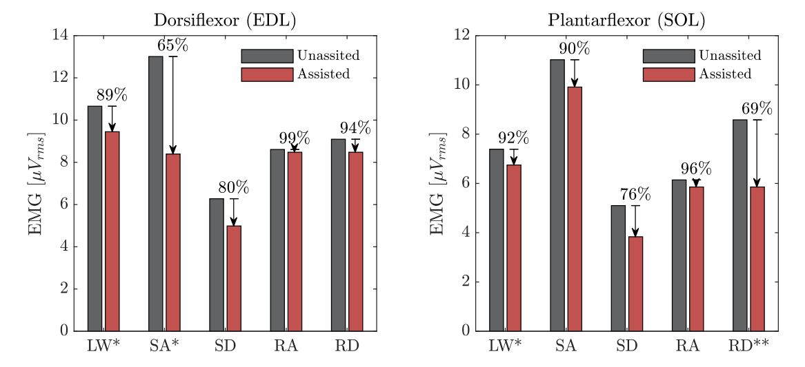

::: {.page-intro}
My research connects human movement understanding with adaptive assistance
and clinical movement assessment. I combine wearable sensing, machine
learning, and control to recognize movement context, estimate joint moments,
and develop assistance through wearable robots and functional electrical
stimulation. Across these projects, I study how measurements of human
movement can inform mobility assistance and rehabilitation.
:::

## Research themes

- **Human Motion Understanding** — Recognizing movement context and estimating joint moments from wearable signals.
- **Adaptive Mobility Assistance** — Adapting robotic assistance and electrical stimulation to human movement.
- **Wearable Movement Assessment** — Quantifying movement for clinical assessment and rehabilitation.

## Selected research
<!-- Replace video placeholders with real videos; see _research-media.md. -->

<button type="button" id="research-overview" hidden>← All research</button>

::: {.panel-tabset .research-tabs}

### [[01 · MOTION REPRESENTATION]{.research-kicker} [DEMO]{.research-demo} [Video coming soon]{.research-badge}]{.research-thumbnail} [Human Motion Understanding]{.research-theme} [Human Motion Representation & Joint Moment Estimation]{.research-card-title} [Learning movement structure and estimating joint moments from wearable signals.]{.research-preview}

#### Human motion representation & joint moment estimation

::: {.research-meta}
Human Motion Understanding · Recent research at LISSI / Prior research at KAIST
:::

My recent work explores representations of human movement and real-time estimation of ankle joint moments from wearable sensor data. I investigate shared movement patterns across walking conditions and how these patterns can support joint moment estimation.

This direction builds on my research at KAIST, where I investigated physics-informed movement analysis and representation learning using a multimodal biomechanics dataset. The broader aim is to connect movement recognition with an understanding of the mechanics of human motion.

::: {.research-video-placeholder}
**Demo video · Coming soon**

Human motion representation and joint moment estimation — demonstration video to be added.
:::

**Research background**

[Research experience at LISSI and KAIST in my CV](cv.qmd)

### [{alt="Data processing, LSTM estimator and orthosis control pipeline"}]{.research-thumbnail .research-thumbnail-media} [Human Motion Understanding]{.research-theme} [Locomotion intention]{.research-card-title} [Recognising the walking terrain from two foot IMUs.]{.research-preview}

#### Locomotion intention detection {#gait-intent}

::: {.research-meta}
LISSI · Wearable sensing / Deep learning
:::

Level walking, stairs and ramps involve different ankle movements and moments. An actuated ankle–foot orthosis therefore needs to identify the walking mode before selecting the appropriate assistance. Manual mode switching can be difficult for people with limited motor control, while rule-based detection requires hand-tuned rules. This study tests whether two foot-mounted IMUs and an LSTM can recognise five walking modes in real time and switch the orthosis controller accordingly.

::: {.gait-study}

##### Real-time LSTM-driven gait mode detection for an actuated ankle–foot orthosis

::: {.research-meta}
IEEE Transactions on Robotics, 2025
:::

```{=html}
<figure class="gait-figure">

<figcaption>Pipeline: IMU data processing and swing detection, the LSTM estimator, and mode-dependent control of the orthosis.</figcaption>
</figure>
```

```{=html}
<div class="gait-system">
<figure class="gait-figure">

<figcaption>System configuration</figcaption>
</figure>
<div class="gait-system-notes">
<p><strong>Component roles</strong></p>
<ul>
<li><strong>IMUs</strong> — one per foot; motion signals drive swing detection and LSTM gait-mode classification.</li>
<li><strong>AAFO</strong> — mode-specific dorsiflexion and plantarflexion assistance: impedance control in stance and trajectory tracking in swing.</li>
<li><strong>EMG</strong> — EDL (front/outer shin) and SOL (rear calf) electrodes record muscle activity to evaluate assistance.</li>
</ul>
</div>
</div>
```

```{=html}
<h6 class="gait-torque-title">Torque generation</h6>
```

::: {.gait-torque-methods}
::: {}
**Stance · impedance modulation**

Virtual stiffness $k$, equilibrium angle $\theta_0$ and damping $b$ set the ankle torque: $\tau=-k(\theta-\theta_0)-b\dot\theta$. The torque responds to ankle angle and velocity.
:::
::: {}
**Swing · trajectory tracking**

Four ankle-angle key points for the detected gait mode are interpolated into a reference trajectory. PID tracking commands the AAFO torque needed to follow it.
:::
:::

```{=html}
<figure class="gait-figure gait-torque-profiles">

<figcaption>Ankle angle, angular velocity and torque profiles across the five walking modes.</figcaption>
</figure>
```

<div class="gait-table-wrap">
<table class="gait-table gait-comparison">
<caption>Offline sequence accuracy, 10 subjects</caption>
<thead><tr><th scope="col">Method</th><th scope="col">Accuracy, mean ± SD (%)</th><th scope="col">F-measure</th></tr></thead>
<tbody>
<tr><th scope="row">k-nearest neighbours</th><td>92.8 ± 1.8</td><td>0.94</td></tr>
<tr><th scope="row">Support vector machine</th><td>93.3 ± 2.0</td><td>0.94</td></tr>
<tr><th scope="row">Random forest</th><td>94.2 ± 1.9</td><td>0.96</td></tr>
<tr><th scope="row">Gradient boosting</th><td>93.2 ± 2.0</td><td>0.94</td></tr>
<tr class="gait-proposed"><th scope="row">LSTM (proposed)</th><td>98.7 ± 0.6</td><td>0.98</td></tr>
</tbody>
</table>
</div>

```{=html}
<figure class="gait-figure">
<div class="gait-figure-grid gait-matrices">



</div>
<figcaption>Real-time confusion matrices (row-normalised) over all subjects. Under the mimicked abnormal gait, shortened strides cause some level walking to be read as ramp ascent.</figcaption>
</figure>
```

```{=html}
<p><strong>Main experimental result</strong></p>
<video class="gait-video" autoplay muted loop playsinline controls preload="metadata" poster="images/gait-main-video-poster.png" width="1280" height="720" aria-label="Real-time gait mode detection and control experiment">
<source src="videos/Experimental_Video_RT_GMD_Control.mp4" type="video/mp4">
<a href="videos/Experimental_Video_RT_GMD_Control.mp4">Download the experimental video</a>.
</video>
```

```{=html}
<div class="gait-figure-grid gait-charts">
<figure class="gait-figure">

<figcaption>Swing-phase ankle joint angle tracking error with and without assistance.</figcaption>
</figure>

<figure class="gait-figure">

<figcaption>EDL and SOL muscle activity with and without assistance.</figcaption>
</figure>
</div>
```

```{=html}
<p><strong>Real-life scenarios</strong></p>
<video class="gait-video" autoplay muted loop playsinline controls preload="metadata" width="1280" height="720" aria-label="Walking on different terrains">
<source src="videos/Various_walking_two.mp4" type="video/mp4">
<a href="videos/Various_walking_two.mp4">Download the walking video</a>.
</video>
```

[Paper](https://doi.org/10.1109/TRO.2025.3593111){.gait-paper-link target="_blank" rel="noopener"}

:::

**Related work**

- [Real-Time LSTM-Driven Dynamic Gait Mode Detection (IEEE T-RO, 2025)](https://doi.org/10.1109/TRO.2025.3593111)
- [Online Human Intention Detection (Humanoids, 2022)](https://doi.org/10.1109/Humanoids53995.2022.10000150)
- [Fuzzy Convolutional Attention-based GRU Network (EAAI, 2023)](https://doi.org/10.1016/j.engappai.2022.105702)

### [[03 · WEARABLE ROBOT CONTROL]{.research-kicker} [DEMO]{.research-demo} [Video coming soon]{.research-badge}]{.research-thumbnail} [Adaptive Mobility Assistance]{.research-theme} [Adaptive Control for Wearable Robots]{.research-card-title} [Adapting robotic assistance to human movement and physical interaction.]{.research-preview}

#### Adaptive control for wearable robots {#wearable-control}

::: {.research-meta}
Adaptive Mobility Assistance · LISSI · Nonlinear control / Human–robot interaction
:::

A wearable robot must coordinate its assistance with the person who wears it. My research investigates adaptive and nonlinear control for lower-limb robotic assistance, with a particular focus on actuated ankle-foot orthoses.

My work includes selectively adaptive fuzzy control for ankle assistance. Collaborative studies extend this research to impedance modulation for sit-to-stand movements, explicit model predictive control for knee rehabilitation, and adaptive neural control of ankle-foot orthoses.

::: {.research-video-placeholder}
**Demo video · Coming soon**

Adaptive control for wearable robots — demonstration video to be added.
:::

**Related work**

- [Hybrid Half-Gaussian Selectively Adaptive Fuzzy Control (IEEE RA-L, 2022)](https://doi.org/10.1109/LRA.2022.3191187)
- [Impedance Modulation for Sit-to-Stand Movements (IEEE T-RO, 2022)](https://doi.org/10.1109/TRO.2021.3104244)
- [Assistive Explicit Model Predictive Control (IEEE/ASME T-Mech, 2022)](https://doi.org/10.1109/TMECH.2021.3126674)
- [Finite-Time Adaptive Neural Output Feedback Control (IEEE TASE, 2026)](https://doi.org/10.1109/TASE.2026.3718534)
- [Funnel-Based L1 Adaptive Fuzzy Control (ICRA, 2024)](https://doi.org/10.1109/ICRA57147.2024.10610584)

### [[04 · ADAPTIVE STIMULATION]{.research-kicker} [DEMO]{.research-demo} [Video coming soon]{.research-badge}]{.research-thumbnail} [Adaptive Mobility Assistance]{.research-theme} [Adaptive FES & Hybrid Assistance]{.research-card-title} [Adapting stimulation timing and intensity for foot-drop assistance.]{.research-preview}

#### Adaptive FES & hybrid assistance {#adaptive-fes}

::: {.research-meta}
Adaptive Mobility Assistance · LISSI · EMG / Functional electrical stimulation
:::

Functional electrical stimulation (FES) provides a way to assist movement by activating muscles. My work investigates adaptive stimulation for foot-drop correction, including the adjustment of stimulation timing and intensity and the use of EMG signals to analyze muscle dynamics.

Related research examines gait-phase detection for combined FES–orthosis assistance. A submitted manuscript studies knee-guided, phase–magnitude decoupled adaptive stimulation for foot-drop correction and remains under review.

::: {.research-video-placeholder}
**Demo video · Coming soon**

Adaptive FES and hybrid assistance — demonstration video to be added.
:::

**Related work**

- [Gait Phase Detection for Hybrid FES–Orthosis Assistance (ICRA, 2021)](https://doi.org/10.1109/ICRA48506.2021.9561497)
- Knee-Guided Phase–Magnitude Decoupled Adaptive Functional Electrical Stimulation for Drop-Foot Correction — submitted to IEEE TNSRE, 2026; under review.

### [[05 · HUMAN–ROBOT INTERACTION]{.research-kicker} [DEMO]{.research-demo} [Video coming soon]{.research-badge}]{.research-thumbnail} [Adaptive Mobility Assistance]{.research-theme} [Human–Robot Interaction for Load Carrying]{.research-card-title} [Controlling interaction forces between the human body and an external load.]{.research-preview}

#### Human–robot interaction for load carrying

::: {.research-meta}
Adaptive Mobility Assistance · Sogang University · Master’s research · March 2017–February 2019
:::

During my master’s research at Sogang University, I developed control methods for lower-limb exoskeletons used in load-carrying tasks. My thesis focused on reducing interaction forces between an external load and the human body through robotic leg control.

This work established the physical human–robot interaction perspective that continues through my research on wearable assistance: understanding how robotic forces interact with human movement.

::: {.research-video-placeholder}
**Demo video · Coming soon**

Human–robot interaction for load carrying — demonstration video to be added.
:::

**Related work**

Control Algorithm of a Robotic Leg for Reducing Interaction Force Between a Load and the Human Body — Master’s thesis, Sogang University, 2019.

### [[06 · CLINICAL MOVEMENT ASSESSMENT]{.research-kicker} [DEMO]{.research-demo} [Video coming soon]{.research-badge}]{.research-thumbnail} [Wearable Movement Assessment]{.research-theme} [Wearable Assessment of Human Movement]{.research-card-title} [Quantifying movement for clinical assessment and rehabilitation.]{.research-preview}

#### Wearable assessment of human movement {#movement-assessment}

::: {.research-meta}
Wearable Movement Assessment · LISSI · Wearable sensing / Clinical movement analysis
:::

I develop wearable sensing methods for quantitative movement assessment. My work examines lower-limb gait and forearm movement in separate clinical applications.

##### Gait assessment after stroke

In gait research, I have worked on a multi-IMU system and experiments involving people with post-stroke hemiparesis, examining lower-limb kinematics and measurement reliability across walking conditions.

Related collaborative research examines changes in walking speed, step length, and lower-limb kinematics over eight weeks of guided self-rehabilitation. This cohort study is described in a submitted manuscript and remains under review.

##### Forearm movement assessment

In a separate project, I analyzed IMU signals from a portable alternometer to quantify forearm pronation–supination for the assessment of parkinsonian motor impairment.

::: {.research-video-placeholder}
**Demo video · Coming soon**

Wearable movement assessment — demonstration video to be added.
:::

**Related work**

Changes in Walking Speed, Step Length, and Lower Limb Kinematics Over Eight Weeks of Guided Self-Rehabilitation Contracts in Hemiparetic Patients: A Prospective Cohort Study — submitted to Journal of Neural Engineering, 2026; under review.

:::
